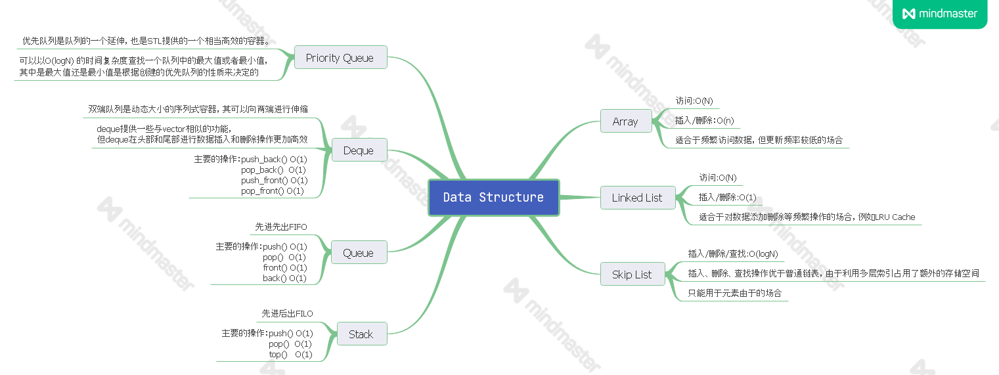

# 学习笔记

## 高效学习方法

* 看视频方法：1.5-2.0倍速观看，遇到难点、重点是放慢速度仔细看。不要像看美剧一样原速看完一遍，效果很差。

* 以前经常会在一道题话很多时间，其实完全没有必要死磕。要敢于死记硬背代码，特别是好的模板代码更要记住。5-10分钟想不出办法直接看答案，然后自己写一遍，再去看别的好代码，给自己一个反馈。

*  五毒神掌，最要紧的是遍数。

    1. 第一遍直接看答案，然后默写

    2. 第二遍马上自己写，不要看别人代码

    3. 第三遍过了一天后，再重复做题

    4. 第四遍过一周后再重复刷题

    5. 第五遍面试前一周，恢复性训练

## 数据结构

